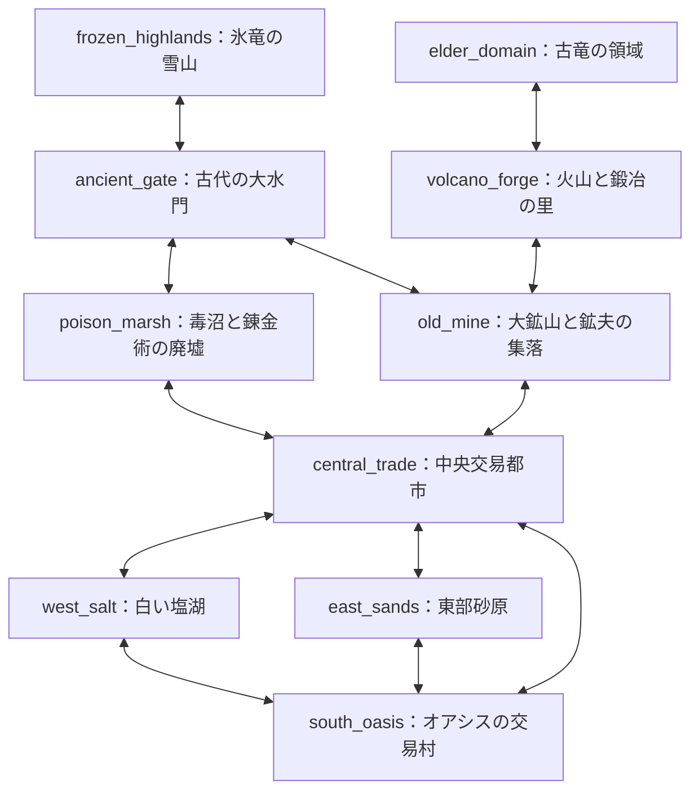

# 砂漠の移動拠点：第1ワールド設計

作成日：2026-10-01（GPT／Linux）。状態：**既存コードの調査と仕様書作成まで。ゲームへの実装は未着手。**

2026-10-02の作業環境更新：継続作業先は既存チェックアウトのmainへ統一した。本書のコード調査・行番号は作成時の `b5bb0b6` に基づく。現在の対象版は開始時にGitで確認し、本書の調査対象を現在の先端と取り違えない。第1ワールドの地域・接続に関する設計は本書を参照し、同じ役割の旧調査文書は当時の記録として保持する。

## 0. この文書の位置づけ

大型移動拠点で地域を往復し、資源・仲間・設備を整えて行動範囲を広げるための、第1ワールドの正本となる設計文書。ユーザーが今回指定した地域・接続関係を優先する。参考画像は雰囲気の資料であり、画像の道路や接続を仕様へ転記しない。

記述の区分は次のとおり。**将来の設計方針が確定していても、その機能が現在実装されているとは限らない。**

| 区分 | 意味 |
|---|---|
| 確認済み | 調査対象のコード・ファイルで確認した現状。根拠を併記する |
| 今回の設計方針 | 今回ユーザーが指定した世界観・地域・接続・範囲 |
| 提案 | 現在の構造を生かすための実装候補。まだゲームには反映しない |
| 未決定 | 数値・操作・採用版など、後続作業で決める事項 |

**確認済み：調査対象と作業ルール**

- 本書作成時の作業先は `/workspace/desert_rats`。2026-10-01の調査基準は、当時の `main` / `origin/main` の `b5bb0b6051bc21ef77dcb4d538f21b45aaf21815`。仕様書作成は同じコミットから作った `gpt/world1-design` で行った。
- `origin/gpt/no-expedition-stamina-recovery` の `c047b7a` も、仲間状態・重量・UIの版差を確認するため参照した。両ブランチは分岐しており、こちらの変更とmainのカメラ・物資庫等を、同時に統合済みとして扱わない。
- 作成時はWindows側の修正ログにある `1aeaa55` を取得できていなかった。2026-10-02の環境更新で、これを含む `origin/main` の `8dc88f2` を取得した。修正コミットの取得と、対象版での実画面・実操作の再検証は区別する。
- `CLAUDE.md` の作業・共同作業ルールと、既存の `docs/GPT連携_ワークベンチ画面.md`、`docs/第1段階の整理_2026-09-27.md` を確認した。本書作成時の `b5bb0b6` のチェックアウトには `AGENTS.md`・READMEはなく、第1ワールドの地域・接続を定義する同役割の仕様書も見つからなかった。2026-10-02の環境更新で取得した旧調査文書とは、冒頭の案内で役割を区別している。
- `scenes/main.tscn:3` が参照する実行スクリプトは `scripts/main.gd`。ルートの `砂漠のネズミ団.gd` はミラーとして扱う。説明文より実際の参照先を根拠にする。
- 2026-10-01の本書作成では、この仕様書と `CLAUDE.md` の作業ログのみを変更した。ゲーム本体・画像・ゲーム内データの変更、コミット、push、公開設定の変更は行っていない。

## 1. 世界観と採用しない旧案

**今回の設計方針**

- 素朴で見やすいファンタジー世界。砂漠、草原、森、鉱山、交易都市、雪山、火山、古代遺跡があり、ドラゴンなどの大型生物が存在する。
- 『ファンタジーライフ』のように、地形と道の関係が読み取りやすい雰囲気を参考にする。参考作品の固有地名・造形・マップを模倣しない。
- 移動拠点に機械や動力はあってよい。世界全体を近代工業地帯にしない。
- 大型拠点が通る基本ルートは、巨大な交易車が昔から使う**幅広い土の街道**。石橋、宿場、停泊場、鉱山の運搬路などにより、通行できる理由を表現する。
- 参考画像にある高速道路、巨大インターチェンジ、近代的な工場群、物流都市、工業区という方向性は採用しない。画像内の名称も下記の固定地域名に置き換える。
- 地図に地域間接続があっても、開始時から通れるとは限らない。地形・準備・修復などで行動範囲が広がる。

**提案／未決定：** 草原・森は、既定の10地域内の景観・探索地点として配置することをまず検討する。具体的な配置は未決定であり、ここで独立地域や新しい地域間接続を追加しない。

## 2. 固定ID付き地域一覧

**今回の設計方針：** 以下のIDと地域名を第1ワールドの基準にする。位置は地図上の相対関係であり、地理座標や距離の確定値ではない。

**資源・施設・危険要素の欄は将来構想を含む。既存アイテムID・レシピ・施設・環境システムの存在を保証しない。**

| 固定ID | 地域名 | 相対位置 | 主な役割・資源（設計方針） | 将来の危険要素 |
|---|---|---|---|---|
| `south_oasis` | オアシスの交易村 | 南部 | 開始地点、休息、初歩的な交易、食料・水 | 低危険 |
| `east_sands` | 東部砂原 | 南東部 | 木材・石・生物素材。まばらな林と遺跡 | 野生生物 |
| `west_salt` | 白い塩湖 | 南西部 | 塩・硫黄・石英 | 足場や環境の悪化 |
| `central_trade` | 中央交易都市 | 中央 | 交易と遠征の中心、大型拠点の停泊場 | 周辺街道の脅威 |
| `old_mine` | 大鉱山と鉱夫の集落 | 中央の東 | 鉄・石炭・銅、設備強化の素材 | 深部の生物・崩落 |
| `poison_marsh` | 毒沼と錬金術の廃墟 | 中央の西 | 薬草・錬金素材 | 毒 |
| `ancient_gate` | 古代の大水門 | 北部中央 | 北へ渡る石橋と古代遺跡 | 橋の損傷・守護生物 |
| `frozen_highlands` | 氷竜の雪山 | 北西部 | 希少鉱石・氷属性素材 | 極寒・氷竜 |
| `volcano_forge` | 火山と鍛冶の里 | 北東部 | 上位鉱石・鍛造素材 | 高熱・火山生物 |
| `elder_domain` | 古竜の領域 | 火山のさらに奥 | 終盤素材・高難度探索 | 古竜・特殊環境 |

**確認済み：既存IDとの関係**

調査したコードにこの10地域IDの既存定義はなく、衝突は見つからなかった。次の既存IDは別の役割であり、地域IDとして読み替えない。

| 既存の名称・ID | 現在の意味 | 地域との関係 |
|---|---|---|
| `scenes/main.tscn` | 横視点プレイ画面の起動シーン | 特定地域の地理データではない |
| `desert` | 外装のアートスタイル／アセット格納名 | 第1ワールド全体や `east_sands` と同一視しない |
| `rock` / `vein` / `tree` | `GatherDB` の採取ポイント種類 | 複数地域の出現候補として参照できる |
| `GameData.Item` | 共通のアイテム定義 | 地域資源表から参照し、同じ素材の別IDを地域ごとに増やさない |
| 部屋・設備のID | 拠点内の構成 | 地域や前哨基地のIDには転用しない |

## 3. 地域接続の正本

**今回の設計方針：** 通常の地域間接続は次の12本だけで、すべて双方向。表と図は同じ内容を表す。道路の具体的な通行条件・開始時の開通状態は別途管理する。

| 接続番号 | 地域A | 地域B | 方向 |
|---|---|---|---|
| 01 | `south_oasis` | `east_sands` | 双方向 |
| 02 | `south_oasis` | `west_salt` | 双方向 |
| 03 | `south_oasis` | `central_trade` | 双方向 |
| 04 | `east_sands` | `central_trade` | 双方向 |
| 05 | `west_salt` | `central_trade` | 双方向 |
| 06 | `central_trade` | `old_mine` | 双方向 |
| 07 | `central_trade` | `poison_marsh` | 双方向 |
| 08 | `old_mine` | `ancient_gate` | 双方向 |
| 09 | `poison_marsh` | `ancient_gate` | 双方向 |
| 10 | `ancient_gate` | `frozen_highlands` | 双方向 |
| 11 | `old_mine` | `volcano_forge` | 双方向 |
| 12 | `volcano_forge` | `elder_domain` | 双方向 |

図の自動配置は方角・縮尺を保証しない。地域の位置は第2節の位置欄を優先する。実際のマップUIでは相対位置と接続の両方を読み取りやすく配置する。

周回の例は「村→砂原→都市→村」「村→塩湖→都市→村」「都市→鉱山→大水門→毒沼→都市」。火山は鉱山から分岐し、古竜の領域はその奥。火山を開始地点の直後へ移さない。

**未決定：** 各接続の初期通行可否、距離、所要時間、開通条件。今回は追加の地域間ショートカットを提案しない。後から検討する場合も、正本の12本に混ぜず別の提案として示す。

## 4. 道路・車体サイズ・通行条件

### 4.1 道路の種類と条件を分ける

**今回の設計方針**

| 道路の種類 | 基本的な役割 | 通行対象との関係 |
|---|---|---|
| 街道 | 大型拠点の基本ルート。幅広い土道 | 大型拠点が通れる設計を基本とする。環境・損傷で一時的に通れないことはあり得る |
| 脇道 | 徒歩や将来の小型探索車両による探索 | 大型拠点用の主要動線にしない。個々の道のサイズ条件は別に持つ |
| 危険な近道 | 距離を短縮する代わりに地形・敵・環境等の負担を伴う | 大型が通れる近道も考えられる。小型専用に固定しない |

**提案：** 通行判定は、道路の種類を見て一括決定するのではなく、次の条件を別々に評価する。

1. 接続／地域内地点が実装対象で、ルートとして利用可能か。
2. 現在の車体・徒歩等が、その道のサイズ条件を満たすか。
3. 必要な環境対策を満たすか。
4. 橋・路面等の修復状態が通行可能か。

道路の種類は説明・演出・基本用途を表す。サイズ条件、環境条件、修復状態の代用品にはしない。通行不能時は不足している条件を表示し、未実装とゲーム内の未開通を区別する。具体的な条件名・数値・判定APIは未決定。

大型拠点は中央交易都市の外周街道と停泊場を使う。狭い市街地、坑道、巣の内部には仲間や将来の小型車両で入る。**地域への到着と、地域内の全地点へ大型拠点で入れることは別。**

### 4.2 現在の描画単位と寸法

**確認済み**

| 対象 | コードで確認した基準 | 根拠・解釈 |
|---|---|---|
| 論理ユニット | 1ユニットを画面4pxに描画 | `data/art_spec.gd:6`、`:20`。画像の密度とは別の配置単位で、mやkmではない |
| 車体画像 | 184×80論理ユニット | `data/art_spec.gd:26`。側面の長手×縦の描画枠。184を全長の参考、80を車体部分の高さの参考にできるが、道路に必要な横方向の車幅ではない |
| 仲間 | 16×16ユニットの基準枠、足元原点 | `data/art_spec.gd:23`、`scripts/character.gd:299` |
| 斜路 | 24×18ユニットの描画枠。歩行は上端(904,484)と下端(992,548)の間 | `data/art_spec.gd:27`、`scripts/game_data.gd:271`。括弧内は現在の画面座標。収納・展開を切り替える仕組みはない |
| 成長後の外装 | 後部荷台やアンテナが基本車体枠の外に出る | `assets/base/exterior/desert/parts.json:10`、`:62`、`data/exterior.gd:127`。描画枠と衝突外形も別 |
| 走行距離 | `Director.distance` は累積画面px。HUDは2500pxを表示上の1kmに換算 | `scripts/director.gd:15`、`ui/event_hud.gd:104`。世界地図の地理的縮尺の根拠にはしない |

車幅、地理的な全長・高さ、操舵・旋回半径、橋の耐荷重との換算は現在定義されていない。地面の画面y範囲や車体画像の縦寸法を車幅に読み替えない。

### 4.3 寸法を決めるための相対条件

**提案：** 走行状態の全長をL、接地面から最上部までの高さをH、車幅をWとして独立に定義する。拠点の成長段階・外装・搭載物を含む外形を将来調査する。今回はL/H/Wの実値、km、道路の画面ピクセル数を確定しない。

| 対象 | 相対条件の提案 | 未決定 |
|---|---|---|
| 街道・石橋 | 有効幅がW＋左右の余裕以上 | W、余裕量、対向通行を設けるか |
| 門・橋の上部構造 | 有効幅がW＋左右余裕以上、上方の空間がH＋余裕以上 | アンテナ等の走行時収納、必要高さ |
| 曲がり角 | L・W・軸配置・操舵から求める旋回時の占有範囲が収まる | 操舵モデルと旋回半径。「半径○Lで通れる」とはまだ決めない |
| 停泊場 | 長さL＋前後余裕、幅W＋左右余裕を確保 | 斜路・出入り・荷役を含む利用領域 |
| 耐荷重 | 最大積載時の拠点重量に対応 | 現在の収納重量から構造荷重への換算。倉庫容量をそのまま橋の荷重にしない |

石橋、道路の曲がり、鉱山の運搬路、停泊場は、この条件と整合する造形にする。ゲーム内の通行を抽象判定にするか、物理的な操舵まで扱うかは後続設計。最小実装に操舵シミュレーションは含めない。

## 5. 前哨基地と地域内探索地点

**今回の設計方針：** 前哨基地は地域内の地点であり、独立地域や第3節の追加ノードにはしない。

| 候補地 | 用途の構想 | 地域への所属の扱い |
|---|---|---|
| 中央交易都市の南側分岐：旧宿場 | 遠征準備 | `central_trade` 内 |
| 大鉱山の入口：荷車ターミナル跡 | 採掘・運搬の支援 | `old_mine` 内 |
| 大水門の手前：廃砦 | 雪山遠征前の備蓄 | `ancient_gate` 内の南側接近地点とする案。入口側の所属・位置は未決定 |
| 火山の手前：宿場跡 | 耐熱装備・遠征物資の準備 | `old_mine`–`volcano_forge` の接近路に置く案。どちらの地域内地点とするかは未決定 |

将来、物資備蓄・休息・修理に利用したい。**自動輸送、倉庫間の共有、遠隔製作、瞬間移動は今回の確定仕様に含めない。** 物資は所在地にある扱いとし、どこからでも利用できる前提を置かない。最小実装ではこれらの機能を作らない。

**今回の設計方針／提案：** 鉱山入口、奥の採掘場、対策が必要な深部、修復後の運搬路、林、遺跡、巣などは地域内探索地点として整理する。地点への脇道や内部運搬路を、地域間接続の追加として数えない。地点ID・具体配置・解放条件は未決定。

## 6. 探索・成長・再訪

**今回の設計方針**

- 地域を順番にクリアする一本道にはしない。欲しい資源と準備状況に応じて往復・周回する。
- 鉄が欲しいなら鉱山へ行き、加工設備を整える。上位装備の準備は鉱山・狩猟・錬金など複数分野にまたがる。
- 雪山遠征は防寒装備、拠点設備、遠征物資などを準備する構想。これらの装備・耐性システムは今回実装しない。
- 同じ鉱山でも入口の鉄、奥の銅、対策が必要な深部、修復後に使える運搬路など、後から戻る理由を作る。銅などの具体アイテムや段階は未実装の将来構想。
- ドラゴンは将来、ボスだけでなく縄張り、地域内の迂回、巣の探索に関わる。討伐だけを唯一の通行条件にせず、準備や別の対応を検討できる余地を残す。
- この方針を理由に、正本にない地域間の迂回路を確定追加しない。特に雪山・古竜の領域の追加接続は未決定。
- 卵、育成、戦闘、環境耐性の詳細は後続設計。

**未決定：** 希少鉱石・属性素材の具体名と数値、地域の危険度数値、設備・装備の解放順、ドラゴンへの対応方法。第1ワールドを固定のレベル順序に置き換えない。

## 7. 現状コードとの対応

以下は原則として基準コミット `b5bb0b6` の**確認済み**事項。別ブランチの内容は版差として明記する。今回の仕様書では実行テストや描画の修正は行っていない。

| 対象 | 現在の実装 | 根拠 | 地域設計への意味 |
|---|---|---|---|
| 移動 | 拠点のローカル座標を固定し、非負の `scroll_speed * delta` で距離を進める。走行時は背景・屋外対象が左へ流れる。カメラ追従では拠点が画面外へ出る場合もある | `scripts/main.gd:223`、`:996`、`scripts/world_scroll.gd:26`、`scripts/resource.gd:21` | 地図上の連続地理座標移動ではない。既存の横視点を維持できる |
| 背景 | 空・雲・遠景・中景・砂丘・地面・小物の7層。共通画像を繰り返す | `scripts/world_scroll.gd:11`、`:31`、`assets/environment/` | 地域別背景の選択・切替はまだない |
| 地域・地図 | Mainで画面を組み立てる。独立した地域定義、地域切替、接続グラフ、マップUIは見つからない | `project.godot:18`、`scenes/main.tscn:3`、`scripts/main.gd:100` | 参考画像と動作するゲーム地図を区別する。別保存先の制作物の存在はこの調査では判断できない |
| 資源出現 | 距離で生成時期を決め、共通の重みから岩場・鉱床・枯れ木を選ぶ | `scripts/main.gd:241`、`:854`、`data/gathering.gd:23` | 地域別出現表を参照する候補。地理固定の資源地点や再訪記録はない |
| 採取残量 | 採取ポイント作成時に初期量を決め、作業で減らす | `scripts/gather_point.gd:13`、`scripts/character_ai.gd:403` | 同じ地点を再作成すると残量保持を別に用意する必要がある |
| 対象の寿命 | 予約はNode内。回収や画面外で削除する。地域内の永続IDはない | `scripts/resource.gd:11`、`:23`、`scripts/character_ai.gd:149` | 描画Nodeの消去と、資源の消費・再生を区別する必要がある |
| 仲間移動 | 地上・下階・上階の経路を使い、斜路・梯子を通る。採取袋や運搬物を持つ | `scripts/game_data.gd:298`、`scripts/character.gd:215`、`scripts/character_ai.gd:157` | 屋外や登攀中の切替で位置・荷物・参照を失わない条件が必要 |
| 拠点内外判定 | 座標による簡易判定 | `scripts/base.gd:77` | 車幅や地理的な通行判定には流用しない |
| 収納・重量 | mainは倉庫中心の重量・容量管理。満杯で入りきらない物を廃棄する経路がある | `scripts/storage.gd:27`、`:47` | 帰還・作業中断だけで荷物保存が保証されるとは言えない |
| 加工 | 注文、搬入予約、加工中の材料・進捗、完成品、作業場在庫を別に保持 | `scripts/processor.gd:24`、`:36`、`scripts/character_ai.gd:218` | 地域切替で設備を再生成しない。材料の二重消費・二重返却を防ぐ |
| 設備・部屋 | 拠点の `built`、Mainの `room_layout`、燃料・耐久、仲間の道具が各所にある | `scripts/base.gd:18`、`:24`、`:28`、`scripts/character.gd:23` | 地域に属する資源状態と、拠点に属する資産を分ける |
| 出来事・遠征 | 既存のDirector・Expeditionが移動距離・時間等に連動 | `scripts/main.gd:230`、`scripts/director.gd:14` | 地域到着で累積値や進行中の遠征を初期化しない。地域別条件は未実装 |
| カメラ | mainは選択仲間を横方向に追従するCamera2D | `scripts/main.gd:109`、`:970`、`:996` | 地理移動用カメラではない。地域図と切り離せる |
| セーブ | `SaveGame`は現在のMainから呼ばれない。現Workerにない `to_dict()` を前提とし、地域状態・加工・設備一式も保存しない | `scripts/save_game.gd:22`、`CLAUDE.md:486` | 地域状態のディスク保存が既にあるとは扱わない |

**確認済み：既存資源と将来資源の区別**

| 設計で使いたい資源 | 現在使える対応 | 最小実装／後続の扱い |
|---|---|---|
| 木材・石 | `tree` → `WOOD`、`rock` → `STONE` | 既存採取を利用可能 |
| 鉄 | `vein` → `IRON_ORE`、既存の加工で `IRON` | 鉱山入口の候補。鉱床から鉄製品が直接出る扱いにはしない |
| 生物素材 | 既存の `CARCASS`、`MEAT`、`HIDE`、`BONE`、`FAT` 等 | 既存ループの範囲で扱う候補。新しい敵・戦闘は追加しない |
| 食料 | `FOOD` と既存レシピ | 開始物資・加工の既存機能と、村の交易・補給サービスは別 |
| 水、塩、硫黄、石英、石炭、銅、薬草、錬金素材 | 該当するアイテムIDは確認できない | 将来構想。今回ID・レシピを作らない |
| 希少鉱石・属性素材・終盤素材 | 具体名・数値を決めていない | 未決定 |

根拠：`scripts/game_data.gd:124` の `Item`、`:155` の `RECIPES`、`data/gathering.gd:23` の `POINTS`。既存の `FUEL` があることを石炭アイテムの存在と読み替えない。

**確認済み：版差と引継ぎ条件**

- `c047b7a` 側は独立したスタミナ変数・計算・公開表示を撤去し、疲労度を使う変更と個体情報UI等の変更がある（同版 `data/crew_status.gd:15`、`scripts/character.gd:29`、`scripts/crew_status.gd:9`）。独立した内部スタミナの保持は取得コードでは確認できない。ユーザーの「疲労度の内部データとして扱う」という意図と、取得済み実装の状態を区別する。地域設計のためにスタミナを再導入しない。
- `c047b7a` 側は重量を倉庫・作業場・加工中・装備・運搬中まで含め、収納できない物を作業場へ退避する変更がある（同版 `scripts/main.gd:410`、`scripts/storage.gd:86`）。main側の倉庫容量や廃棄処理と混ぜて、統合済みの仕様としない。
- mainのカメラ等がこの枝にないことは未統合の版差。意図的な撤去と断定しない。
- `c047b7a` 側では既存の `Expedition`・遠征UIも撤去されている（同版のMainとファイル一覧を確認）。以下の遠征保持は、採用版にその機能が存在する場合に限る。地域内探索のために旧遠征を再導入する指示ではない。
- 次回実装前に、ユーザーの意図する仲間状態・情報パネル・重量の変更と、背景／カメラ修正版を含めた採用コミットを確認する。今回ブランチの統合や修正はしない。
- 既存の背景の欠け、固定出現位置、重なり順、クリック選択等のQAと、今回の地域設計は別作業。地図設計だけで既存描画問題が解消するとは扱わない。

mainでは旧方式の戦闘生成は `ENABLE_COMBAT = false`、出来事としての襲撃は `ENABLE_RAIDS = true`（`scripts/game_data.gd:10`、`:12`）。「最小案に新しい戦闘を入れない」と、既存襲撃まで撤去することは別。今回フラグやイベントを変更せず、地域別の危険設定は後続検討とする。

## 8. 地域・ルート選択方式の評価

**提案：第一候補は「地図で地域・ルートを選び、横視点で移動・採取する方式」。**

| 案 | 現在の構造との対応 | 評価 |
|---|---|---|
| 地域・ルート選択＋既存の横視点 | 接続グラフと進行状態を加え、背景・今後の資源出現へ接続する | 第一候補。拠点内部・仲間AI・加工を保ちやすい |
| 巨大な連続見下ろしワールド | 地理座標、拠点の操舵、衝突、仲間移動、カメラ等を新設・再設計する | 今回の前提にしない。必要なら別プロジェクト範囲として検討 |

### 8.1 地図とプレイ画面の対応

**提案：** 次の値を分け、同じ座標として使わない。

| 値 | 役割 |
|---|---|
| 地図の表示位置 | 南北・東西と道の関係を説明する抽象配置。描画用で、移動距離の根拠にしない |
| 現在地域・出発地・到着地 | 現在いる地域、選択した接続、移動方向 |
| 経路内の進捗 | 選択した経路でどこまで進んだか。到着判定に使う。長さ・単位は未決定で、既存走行量pxとの換算を定義してから加算する |
| 横視点の描画・AI座標 | 拠点、仲間、資源の画面内移動。今あるローカルなプレイ空間 |
| 累積走行距離・ゲーム内時間 | 燃料、摩耗、既存の出来事・成長など。地域到着でリセットしない |

往路・復路は出発地と到着地で表す。画面の移動は両方向の旅とも、既存の非負の速度を使い、走行時は右→左スクロール、停止時は0とする候補。**地図で西や南へ戻るために `scroll_speed` を負にしない。** 現在は燃料消費、対象の左側消去、AIの追いつき判定等が正方向を前提にしている（`scripts/base.gd:195`、`scripts/resource.gd:23`、`scripts/character_ai.gd:443`）。

マップには地域名、現在地、選択ルート、到着先、通行可否と理由を表示する案。巨大な画像の上を拠点が物理走行する仕組みは不要。横視点では現在地域／経路の表示と、既存資源の出現差を確認できるようにする。ショートカットキー、地図表示中にゲームが進むか、到着の通知と操作は未決定。既存のUI開閉処理を調べて接続し、同じ役割のパネルを重複させない（`scripts/main.gd:797`）。

### 8.2 地域切替を接続する場所

**提案：** `Main._process()` で確定した走行量を、既存の燃料・摩耗・Director処理と並行して、選択ルートの進捗へ渡す。経路の単位を決め、走行量pxから必要な換算を行う。地域選択の責務を資源Nodeや仲間AIへ分散させない。到着要求と実際の地域切替は分け、次節の安全条件を満たしてから確定する。

- `WorldScroll`：背景の選択・切替を受け取る候補。レイヤー構成・背景プロファイルの具体形は未決定。
- 資源生成：`_spawn_ground_resource()` の共通抽選を、地域／経路の出現候補と残存状態の参照へ接続する候補。
- 生物・出来事：現在の共通処理は残り、将来地域条件を接続する候補。最小実装で新しい危険・敵・戦闘を追加しない。
- 到着・滞在：次の接続を選ぶまで進行を待つ案。到着地点で停泊するか、次の移動を自動継続するかは未決定。

カメラの大改修や連続地理座標への置換は、この候補方式に必須ではない。既存背景がパン範囲を覆うこと、資源出現・消去が採用版のカメラと整合することは、次回の描画確認項目とする。必要なカメラ修正は別作業として報告する。

## 9. 切替時の仲間・物資・設備の保持

### 9.1 状態の所有先

**提案：** 画面を丸ごと作り直さず、Main・拠点・仲間・収納・加工設備を保ち、地域側の背景と屋外対象だけを交換する。

| 所有先 | 保持する状態の例 |
|---|---|
| 拠点・仲間 | 倉庫・作業場・運搬物、装備・道具、仲間状態、部屋、設置設備、建設・加工注文、加工進捗・完成品、燃料・耐久 |
| 地域／地域内地点／経路 | 資源の残量・回収済み履歴、出現済み生物、将来の修復状態、地域内施設の状態 |
| 移動全体 | 現在地、選択ルートと進捗、累積距離・時間、出来事の進行、採用版に存在する場合の遠征状態 |

Main再生成は初期物資の再配布（`scripts/main.gd:125`）や拠点のリセットにつながるため、地域切替には使わない候補とする。

### 9.2 安全な切替手順

以下は**未実装の提案**。単に屋外Nodeを削除して転送する方式は採用しない。

1. **要求**：正本にある接続と通行条件を確認し、切替待ちにする。切替待ちの間は新しい屋外採取・狩猟への割当を止める。
2. **帰還**：採取中の残量・進捗と作業端数を帰還指示前に記録し、持っている袋・運搬物を保って帰還させる。屋外の仲間を消去・瞬間移動させない。斜路・梯子の途中は、安全な移動区間の終わりを待つ。
3. **荷卸しと整合**：外から持ち帰る物が保管できることを確認する。収納不能なら理由を表示して切替を待たせる案。物を廃棄して切替完了にしない。退避先や積載超過時の方針は採用版に合わせて決める。
4. **記録・参照解除の準備**：資源残量、回収・枯渇状態、必要な生物状態の記録を整える。屋外対象を指す `res/prey/enemy`、`claimed_by/hunted_by` 等を解除できることを確認する。旧Nodeを持つ予約を新地域へ移さない。
5. **確定**：短い切替区間だけ関係処理を止め、最終記録・屋外参照の解除と検査・旧Nodeの撤去を同じ停止区間で行い、新地域の既存状態から生成する。採取・回収・新規出現が最終記録へ割り込まないようにし、遅延生成・消去も旧地域と新地域で混在させない。屋内の仲間、収納、設備、加工Nodeを作り直さない。
6. **再開**：現在地・表示・次の出現対象を更新する。追従カメラは保持した有効な仲間を参照し、消去済み対象へ飛ばない。累積距離・時間や物資をリセットしない。

切替が失敗・取り消された場合は旧地域を維持／復元し、物資・進捗・予約を二重に適用しない。帰還不能・収納不能などを検出した場合、無期限に無表示で待たせず理由と取り消し操作を提示する案。

**確認済みの注意：** mainの `stop_work()` は、満杯の倉庫へ物資を返す際に廃棄へ進むことがある（`scripts/character.gd:93`、`:112`、`scripts/storage.gd:27`）。これを地域切替の万能中断処理として呼んでも、荷物の保存は保証されない。該当する採用版の挙動を調べ、切替前の検証事項にする。

**確認済み／未決定：** 採取の進捗はポイントの `work` だけでなく、AIの `bag_frac/gather_ev` 等にも分かれる。既存の `_finish_trip()` / `_release_task()` は一部をリセットする（`scripts/character_ai.gd:403`、`:406`、`:430`、`:734`）。帰還前に記録した進捗を、リセット後の0で上書きして「保持済み」としない。端数を地点・仲間のどちらへ保持するか、別の仲間が再開した場合、適用と丸めをどう扱うかは次回に確定する。保存だけで無料の追加採取を生まないことも確認する。

**提案：** 屋内の加工完了は必ずしも待たない。`orders/incoming/current/progress/output/stock` と屋内運搬を保持して再開する。既に搬入・消費した材料や燃料を戻して再消費しない。地域切替のために重量制限を増減させない。

**未決定：** 移動中の到着判定後に停止・減速する方法、手動帰還との関係、採用版に遠征がある場合にその処理中の地域移動を許すか、到着待ちのUI、キャンセル時の進捗。既存遠征がある版でも地域内探索とは別機能なので、無条件に同一扱いにしない。

## 10. 出入りによる無制限復活を防ぐ

**確認済み：** 現在は距離に応じて新規資源を生成する方式で、地域再訪を扱う状態管理はない。乱数シードだけを保存しても、採取・回収済み状態は保持できない。

**提案：最小実装ではセッション内の有限な資源記録を保持する。**

- 地域／地点／経路に属する資源へ安定したIDを付け、初期量、残量、回収済み・枯渇状態、生成進行を記録する。
- 同じ地域へ戻ったときは、その記録から復元する。毎回新しい初期量や出現枠を与えない。
- 毎回別IDを発行して無限に出すことも避ける。有限の地点一覧または有限の遭遇枠を決め、同じ枠の記録を参照する候補とする。枠数・密度は未決定。
- 往路と復路で同じ街道の資源を扱う場合は、A→BとB→Aで共有する接続の識別子を使う。方向を変えるだけで別の資源プールにしない。地域・経路のどちらが資源を所有するかは一貫して定義する。
- 採取・回収の時点で記録を更新し、画面外でNodeを消す前にも必要な状態を同期する。出発時だけの記録では、それ以前に削除された対象の履歴が失われる。
- 描画範囲から外れたことは「資源が再生した」条件にしない。掘りかけの量・採取進捗、落ちている袋の回収状態も必要に応じて保持する。
- 既存生物を地域状態の対象にする場合はHP・死亡・獲物生成済みを保持し、復路・再入場で獲物を二重生成しない。Node参照による予約は保存せず、切替で解放する。
- 最小候補では、同一セッション中の自動再生を入れず、枯渇を保持する。再生を入れる場合はゲーム内経過時間等の条件と前回更新を記録し、入退場そのものを補充条件にしない。

**未決定：** 資源の配置数・再生有無・再生時間、放置やゲーム終了中の時間の扱い、未回収物の寿命、地域状態のディスク保存。有限資源のバランスと再訪する理由は後続調整が必要。上記のセッション内保持だけでは、ゲーム再起動やロードをまたぐ復活問題は解決しない。休眠中の `SaveGame` を完成済みとして流用せず、保存対応は別工程で設計する。

## 11. 地域・道路・資源情報の一元管理案

**確認済み：** 現在は `data/gathering.gd` の `GatherDB`、`data/facilities.gd` の `FacilityDB`、`data/rooms.gd` の `Rooms`、`data/exterior.gd` の `ExteriorDB` 等が定義表を持つ。アイテム・レシピは `GameData`、進行中の状態はMain・拠点・仲間・設備に分かれている。専用の世界／地域データはまだない。

**提案：** この構造に合わせ、将来 `data/world.gd` のような一つの定義窓口（仮称 `WorldDB`）を第一候補とする。**名称・配置・APIは未決定で、今回このファイルやシステムを作らない。**

| 管理する情報 | 管理案 |
|---|---|
| 地域 | 固定ID、表示名、相対的な地図配置、地域内地点、背景・出現プロファイルへの参照 |
| 通常の地域間道路 | 正本の12接続。各接続を一度だけ定義して双方向を導く。道路の種類、サイズ、環境、修復条件を別フィールドにする |
| 地域内地点・道 | 親地域IDを持たせ、地域接続グラフのノードへ混ぜない。前哨基地・内部の脇道もここで区別する |
| 資源出現の定義 | 既存 `GatherDB` の種類と `GameData.Item` を参照する。種類・重み等の地域差を一か所から引く。素材・レシピ本体は複製しない |
| 背景 | 共通レイヤーへ渡すプロファイル参照。画像から接続を逆算せず、地図の絵を道路データの正本にしない |
| 進行中の状態 | 現在地・経路進捗・地域別残量などは、定義表と分けた実行時状態として保持する。定義の初期値を書き換えてセーブ代わりにしない |

仕様書の接続表、ゲームの移動候補、マップ線が別々に増殖しないよう、実装時は同じ接続定義を参照する。地域別の容量・疲労等を新しい世界管理へ重複実装しない。既存の重量・設備・仲間状態の窓口を利用する。

## 12. 次回の最小実装候補

### 12.1 範囲

**今回の設計方針：** オアシスの交易村、東部砂原、大鉱山の入口を行き来する街道と地域切替。中央交易都市を最小限の通過地点として扱う案を検討する。

**提案：** 最小案で扱う地域IDは次の4つ。鉱山入口は `old_mine` 内の地点であり、新地域IDにしない。

| 地域 | 最小案で確認する役割 | 後回し |
|---|---|---|
| `south_oasis` | 開始地域・帰還先、地域表示と切替 | 新しい交易、休息サービス、水システム、村の詳細 |
| `east_sands` | 木材・石など既存資源の出現差、採取・運搬 | 新しい生物、遺跡内部、追加の戦闘 |
| `central_trade` | 既定接続を守るための通過地域、次の道の選択 | 都市機能、豪華な専用背景、市街地探索、前哨基地機能 |
| `old_mine` の入口 | 既存鉱床・鉄鉱石、持ち帰りと既存加工の確認 | 石炭・銅、坑道、深部、崩落、集落機能 |

対象の街道は正本の01・03・04・06を使う候補。往復例は「村→砂原→都市→鉱山入口→都市→村」。**砂原→鉱山の直接接続は作らない。** 都市を省略した架空の辺でつなぐのではなく、実際に `central_trade` への到着・出発を記録する。

4地域間の街道をテスト用に通行可能にする案と、完成版の初期開通状態は別。残る地域は未実装として扱い、実装済みの閉鎖道路のように表示しない。全体マップを先に見せるか、最小範囲だけ表示するかは未決定。

既存の移動・採取・運搬・収納・加工ループを利用する。既存の岩場・鉱床・枯れ木の選択差と、地域名・背景の見た目を確認する。出現量・重み・経路長は次回の提案と検証で決め、ここでは数値を確定しない。新しい交易、前哨基地、ドラゴン、戦闘、小型車両は含めない。

背景はまず既存レイヤーを利用できる範囲で差を付ける案。必要な新規画像や本格的なオアシス・鉱山背景の制作は別工程とし、既存の砂漠画像が完成した村・鉱山の景観であると説明しない。見た目の差を何で出すかは未決定。

### 12.2 実装の手順（次回以降）

以下は**提案する順序**であり、今回実施しない。

1. **採用版を確定**：未統合の疲労度・個体情報・重量・カメラ／背景修正の所在を確認。保持する状態と満杯時の挙動を調べ、既存の損失・参照切れが切替で悪化しない前提をそろえる。
2. **定義と状態を分ける**：固定10ID・12接続を一か所へ定義する候補を具体化し、最小4地域・4接続の操作範囲を限定。既存素材の参照と有限な資源記録を設計する。
3. **経路選択と進捗**：既存の正の走行量を使い、出発・到着・進捗を管理。累積距離・燃料・摩耗は維持し、復路で速度を負にしない。
4. **安全な到着・切替**：屋外の作業停止要求、帰還、荷卸し、参照解除、状態記録、地域側のみ交換、取り消し・失敗時の保持を接続する。
5. **既存出現・背景へ接続**：地域ごとの既存資源候補と残量を参照して生成。再入場で補充しない。画像・カメラの変更が必要なら別の変更範囲として提示する。
6. **最小マップUI**：地域名、現在地、正本にある接続、到着先を表示・選択する。中央交易都市の通過を省略せず、地域内地点と区別する。
7. **移動・採取・運搬・収納の往復確認**：下記の不変条件と採用版の既存診断を確認して、次の機能へ進む前に結果を報告する。

### 12.3 確認項目（実装時の完了判定候補）

**提案：** 少なくとも次の項目を、実際の挙動・残量・物資を見て確認する。仕様書を作っただけでは合格扱いにしない。

| 項目 | 確認する結果 |
|---|---|
| 接続の正確さ | 全体定義は10地域12双方向接続。最小範囲は4地域4接続。砂原と鉱山の直接辺、前哨基地の地域ノードがない |
| 往路・復路 | 村・砂原・都市・鉱山入口を正規ルートで往復できる。累積距離は増え、復路で燃料が増えない |
| 地域表示と見た目 | 選択先・到着先・横視点の地域表示が一致する。既存資源の種類差と背景の差を確認できる |
| 採取中の切替 | 中断前後で資源残量と手持ちが整合し、ポイントのwork・AIの袋の端数と評価の扱いが決定どおり。進捗の消失・無料の採取完了・物資の二重生成がない |
| 運搬・屋外・登攀 | 持ち物を保って帰還し、安全な位置で切り替わる。仲間が消えず、旧資源Nodeへの無効参照が残らない |
| 倉庫満杯 | 切替完了のために物が廃棄されない。採用版の退避／待機理由が表示され、取り消せる |
| 加工中・建設中 | 予約・材料・注文・進捗・出力・設備が保持され、材料や燃料の二重消費・二重返却がない |
| 拠点の資産 | 設備、部屋、装備、仲間状態、重量計算、燃料、耐久が保たれ、開始物資が再配布されない |
| 資源再訪 | 部分採取・枯渇・回収済みが再入場／復路でも保持される。画面外削除や往復だけで出現枠が新しくならない |
| 生物を対象にする場合 | 死亡・獲物生成済みが保持され、同じ個体から獲物が再生成されない |
| UI・カメラ | 既存HUDと地図表示が整合し、仲間追従・クリック選択・画面端の背景と出現が採用版の仕様どおり |
| 累積状態 | 地域切替でDirector・時間、および採用版にある遠征を初期化しない。再入場で既存の出来事を不正に回避・再獲得しない |
| 失敗・取消 | 切替要求の取消・生成失敗で旧地域と物資・進捗が保持され、半分だけ新地域にならない。queue_free待ちや遅延生成が旧・新地域で混在せず、同じ対象を二重に記録・復元しない |

この文書の作成時に確認したのはコードと仕様の整合、および接続表と図の一致まで。Godotでの地域切替検証は、まだ機能がないため未実施。

## 13. 未決定事項と次回の境界

| 未決定事項 | 決める時期・境界 |
|---|---|
| 次回実装の基準コミットと未統合変更の扱い | 実装前。今回のmain基準を最新のゲーム仕様だと決めつけない |
| 各道の初期開通・通行条件 | 最小範囲のテスト用設定と完成版を分けて提案 |
| 経路長・進捗の単位・所要時間 | 既存速度・燃料・摩耗・仲間の往復を見て提案。世界のkmや固定画面pxを先に決めない |
| L/H/W・成長後の外形・旋回・停泊余裕 | 実車の地理的寸法は未定義。現在の側面描画単位と混同しない |
| 地域内地点のIDと配置、前哨基地境界の所属 | 地域内探索の詳細設計。固定地域IDを増やさない |
| 背景プロファイルと最小の見た目の差 | 既存画像で確認できる範囲を提案。新しい画像制作は今回の範囲外 |
| 資源の所有先・有限枠・重み・再生・回収物寿命 | 既存資源を使う最小案から検証。新素材のID・数値は後続 |
| ディスク保存と再起動後の資源状態 | セッション内保持とは別工程。休眠SaveGameを完成済みとみなさない |
| 収納不能、帰還不能、遠征中の切替方針 | 仲間や荷物の保持を満たす条件を実装前に具体化 |
| 地図UIの開閉・時間進行・到着停止／継続 | 既存UIとの整合を確認して提案 |
| 世界定義のファイル名・API・実行時状態の窓口 | `data/` の既存定義方式を第一候補とし、実装時に責務を決める |
| 交易、前哨基地、ドラゴン、卵・育成、戦闘、環境耐性、小型車両 | すべて後続設計。最小実装には追加しない |

次回の最小範囲は、**村・砂原・鉱山入口＋都市の通過地点、正式な街道、地域切替、既存の採取・運搬・収納の往復確認**。今回の完了は仕様書の作成までであり、ここからゲーム本体の実装へ自動的に進めない。
