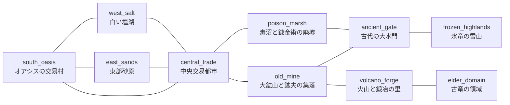

# 第1ワールド設計仕様書（2026-09-30）

> 2026-10-02：本書は2026-09-30時点の調査・提案の記録として保持する。第1ワールドの現行設計文書は [GPT連携_第1ワールド設計.md](GPT連携_第1ワールド設計.md)。本書の「確認済み」や提案を、現在のmainの実装状態・採用済み仕様として読み替えない。継続作業先と同期手順は `CLAUDE.md` を参照する。

## 0. これは何か

ユーザーの指示により、**今回は仕様書の作成のみ**を行った。ゲーム本体のコード・画像・ゲーム内データ（`GameData.Item` などの実データ）は一切変更していない。変更したのはこの1ファイルだけ。

### 凡例（不明点の扱い）
この文書では、指示どおり次の4つを区別して書く。
- **確認済み**: 現在のコードを実際に読んで確認した事実。
- **今回の設計方針**: ユーザーが今回の指示で明確に決めた事項（本文そのまま、または言い換え）。
- **提案**: 私（Claude）が今回の調査を踏まえて出す案。まだ決定ではない。
- **未決定**: 指示文だけでは決められず、ユーザーの判断が要る点。軽微なものは仮の扱いを決めて先に進み、ここに記録した。

### 読んだもの（調査の根拠）
`CLAUDE.md`（作業ルール・現状の実装・共同作業ルール）、`scripts/main.gd`（`砂漠のネズミ団.gd` と同内容）、`scripts/world_scroll.gd`、`scripts/game_data.gd`、`scripts/resource.gd`、`scripts/gather_point.gd`、`scripts/base.gd`、`scripts/character.gd`、`scripts/character_ai.gd`、`scripts/director.gd`、`scripts/expedition.gd`、`data/expeditions.gd`、`data/events.gd`、`data/exterior.gd`、`data/art_spec.gd`、`data/rooms.gd`、`data/facilities.gd`、`data/gathering.gd`、`docs/第1段階の整理_2026-09-27.md`、`docs/GPT連携_ワークベンチ画面.md`。

---

## 1. 世界観と、採用しない旧案

**今回の設計方針**（ユーザー提示のまま採用）:
- 素朴で見やすいファンタジー世界。砂漠・草原・森・鉱山・交易都市・雪山・火山・古代遺跡がある。ドラゴンなどの大型生物が存在する。
- 地形と道の関係が分かりやすい雰囲気（ファンタジーライフを参考にするが、固有の地名・造形・マップは模倣しない）。
- 移動拠点には機械・動力があってよいが、世界全体を近代工業地帯にはしない。大型拠点が通る道は、交易車が昔から使う幅広い土の街道。石橋・宿場・停泊場・鉱山の運搬路などで「大型車が走れる理由」を示す。
- **採用しない旧案**: 以前チャットで見せた画像にあった高速道路・巨大インターチェンジ・近代的な工場群。画像は雰囲気の参考にとどめ、地域と接続関係は本書の文章を優先する。

**確認済み（既存メモとの関係）**: `CLAUDE.md`「世界観の方針」には、以前から「将来: 砂漠以外のマップ（地下・海・深海・異世界・石器時代）」という抽象的な将来メモがある。今回ユーザーが提示した10地域のファンタジー世界は、この抽象メモをより具体的に置き換えるもの。両者は矛盾しないが、**このメモ自体は今回更新していない**（「ゲーム本体・データは変更しない」に、ドキュメントの大幅書き換えは含めないと判断したが、内容の矛盾を防ぐため、この事実だけは明記しておく）。CLAUDE.md 側の更新要否は 8章の完了報告で扱う。

---

## 2. 固定ID付き地域一覧

ユーザー指定のIDをそのまま採用した。

| ID | 地域名 | 位置 | 主な役割・資源 | 将来の危険要素 |
|---|---|---|---|---|
| `south_oasis` | オアシスの交易村 | 南部 | 開始地点、休息、初歩的な交易、食料・水 | 低危険 |
| `east_sands` | 東部砂原 | 南東部 | 木材・石・生物素材。まばらな林と遺跡 | 野生生物 |
| `west_salt` | 白い塩湖 | 南西部 | 塩・硫黄・石英 | 足場や環境の悪化 |
| `central_trade` | 中央交易都市 | 中央 | 交易と遠征の中心。大型拠点の停泊場 | 周辺街道の脅威 |
| `old_mine` | 大鉱山と鉱夫の集落 | 中央の東 | 鉄・石炭・銅。設備強化の素材 | 深部の生物・崩落 |
| `poison_marsh` | 毒沼と錬金術の廃墟 | 中央の西 | 薬草・錬金素材 | 毒 |
| `ancient_gate` | 古代の大水門 | 北部中央 | 北へ渡る石橋と古代遺跡 | 橋の損傷・守護生物 |
| `frozen_highlands` | 氷竜の雪山 | 北西部 | 希少鉱石・氷属性素材 | 極寒・氷竜 |
| `volcano_forge` | 火山と鍛冶の里 | 北東部 | 上位鉱石・鍛造素材 | 高熱・火山生物 |
| `elder_domain` | 古竜の領域 | 火山のさらに奥 | 終盤素材・高難度探索 | 古竜・特殊環境 |

**確認済み（ID衝突チェック）**: `data/rooms.gd`（`workshop`/`bedroom`/`storage`/`engine`/`infirmary`/`mess`/`training`/`empty`）、`data/facilities.gd`（`workbench`/`bed`/`cargo_rack`/`supply_cache`）、`data/gathering.gd`（`rock`/`vein`/`tree`、枠 `mine`/`chop`）、`data/events.gd`（`sandstorm`/`raid_scorpion`/`breakdown`/`ruins_small` 等）、`data/expeditions.gd`（`careful`/`normal`/`bold`、関門 `explore`/`trap`/`guardian`/`hazard`）を確認したが、上記10地域IDと**衝突する既存IDはない**。

**確認済み（アイテム・レシピとの関係）**: 資源名（鉄・石炭・銅、塩・硫黄・石英、薬草・錬金素材、希少鉱石・氷属性素材、上位鉱石・鍛造素材など）は、現在の `GameData.Item`（`MEAT/HIDE/BONE/FAT/WOOD/STONE/IRON_ORE/IRON/FOOD/FUEL/REPAIR_KIT/CARCASS` と道具5種）と**対応付けていない**。指示どおり「既存のアイテムID・レシピ・システムがある」とは扱わず、将来構想として名前だけ記録した。具体的なアイテム定義・数値は未決定。

---

## 3. 接続表とMermaid接続図

**今回の設計方針**（ユーザー指定のまま、正）。すべて双方向。「接続がある」ことと「開始時から通行できる」ことは別（4章）。



上の図は接続表と1対1で一致する（12本の辺、すべて指示どおり）。`central_trade` が3つの南側地域（`south_oasis`/`east_sands`/`west_salt`）と2つの奥地域（`old_mine`/`poison_marsh`）を結ぶハブになっており、火山（`volcano_forge`）は `old_mine` 経由の分岐で、開始地点の直後には置かれていない（指示どおり）。一覧にないショートカット（例: `east_sands` から `old_mine` への直行路）は、この表には含めていない（4章で「提案」として扱う）。

---

## 4. 道路と拠点サイズの扱い

**今回の設計方針**（ユーザー指定のまま）:
- **街道**: 大型移動拠点が通れる基本ルート。幅広い土道。
- **脇道**: 徒歩や、将来の小型探索車両向け。
- **危険な近道**: 距離を短縮できるが、地形・敵・環境などの負担がある。
- 「道路の種類」「通れる車体サイズ」「必要な環境対策」「修復状態」は**別々の条件**として扱う（危険な近道＝小型専用、という固定関係にはしない）。
- 大型拠点は `central_trade` の外周街道と停泊場を利用する。狭い市街地・坑道・巣の内部には、仲間や将来の小型車両で入る（地域に到着できても、その地域の全地点に大型拠点が入れるわけではない）。

**提案（データの持ち方）**: 上の4条件を、1本の道路につき独立した属性として持たせる案。
```
{ from, to, kind: "highway" | "side" | "shortcut",
  large_base_passable: bool,
  hazard_tags: [...],       # 環境対策が要る理由（暑さ・寒さ・毒・高低差など）
  repair_state: "intact" | "damaged" | "blocked" }
```
これなら「危険な近道だが大型拠点も通れる（修復すれば）」のような組み合わせも表現できる。

**確認済み（車体・単位の実測値。km/pxの確定はしない。指示どおり参考値のみ）**:
- 画面は 1280×720px 固定。論理ユニット1つ＝4px（`ArtSpec.UNIT_PX`）。
- 車体の断面（`ArtSpec.HULL`）は 184×80 ユニット＝画面上 736×320px。車体位置 `GameData.HULL_POS = (176, 194)`。車輪の間隔（`GameData.WHEEL_X`）は 296〜792px（軸間 約496px）。
- **拠点自体はワールド座標上で一切動かない**（`HULL_POS` は定数）。「進んでいる」ことを表しているのは、背景の視差スクロール（`WorldScroll._draw()` のオフセット計算）と、資源・生物ノードが自分で `position.x -= scroll_speed*delta` していく仕組み（後述6.1）。
- 走行距離は `Director.distance`（px の累積スカラー）のみで管理されており、ゲームオーバー画面の演出文だけに `distance / 2500.0` という「km換算」が1箇所ある（`scripts/main.gd` の `_game_over()`）。これは表示上の演出であり、公式な距離スケールの定義ではない。

**未決定**: 12本の接続のうち、どれが街道／脇道／危険な近道かは、今回は指定されていない。橋の幅・曲がり角・停泊場の具体的な数値も未決定（指示どおり、今回は確定しない）。**提案**として、8章の最小実装範囲に含まれる `south_oasis`⇄`east_sands`⇄`central_trade`⇄`old_mine` は、大型拠点が実際に通行する前提の区間なので「街道・大型拠点通行可」として扱うのが自然。それ以外（`west_salt` 側、`poison_marsh`・`ancient_gate`・`frozen_highlands`・`volcano_forge`・`elder_domain` 側）は未定のまま次回以降に持ち越す。

---

## 5. 前哨基地と地域内探索地点

**今回の設計方針**: 前哨基地は独立した地域ではなく、**地域内の1地点**として扱う。将来は物資備蓄・休息・修理に使うが、**自動輸送・倉庫間の共有・遠隔製作・瞬間移動は今回の確定仕様に含めない**。前哨基地の物資は「どこからでも使える」前提にしない。

これは、2026-09-30に実装済みの「加工品を使う設備（物資庫）」で確認した既存の設計思想（倉庫⇄作業場は自動リンクせず、仲間が運ぶ既存の受け渡し方法をそのまま使う。`CLAUDE.md`「加工品を使う設備と、設置後の効果」節）と同じ方向で、**一貫している**（確認済み）。

| 前哨基地 | 所属地域（本書での扱い） | 備考 |
|---|---|---|
| 中央交易都市の南側分岐（旧宿場） | `central_trade` | 名称どおり中央交易都市の一地点。確定的。 |
| 大鉱山の入口（荷車ターミナル跡） | `old_mine` | 大鉱山地域の入口側の地点。確定的。 |
| 大水門の手前（廃砦） | `ancient_gate`（提案） | **未決定**: 「手前」が `ancient_gate` 内の手前側か、そこへ至る `old_mine`/`poison_marsh` 側の最奥かは、文面だけでは決められない。本書では暫定的に `ancient_gate` の地点として置く。 |
| 火山の手前（宿場跡） | `volcano_forge`（提案） | **未決定**: 同様の理由で、`old_mine` 側の最奥か `volcano_forge` 側の入口かが未確定。本書では暫定的に `volcano_forge` の地点として置く。 |

### 地域内探索地点の考え方（今回の設計方針）
一本道で地域を順番にクリアする構造にはしない。同じ地域にも後から戻る理由を作る（例: 鉱山なら入口の鉄・奥の銅・対策が必要な深部・修復後に使える運搬路）。地域内の探索地点と、地域間の道路は区別する。

### ドラゴンの扱い（今回の設計方針）
ドラゴンは将来、ボスだけでなく縄張り・迂回・巣の探索にも関わる存在にする。討伐だけを唯一の通行条件にせず、準備や別ルートでも対応できる余地を残す（3章の「接続がある≠通行できる」の区別が、この余地のための土台になる）。卵・育成・戦闘・環境耐性の詳細は後続設計。**今回は実装しない**。

---

## 6. 現状コードとの対応・未決定事項

### 6.1 移動はワールド座標上の移動か、背景スクロールか（確認済み）
両方の性質が組み合わさっている。
- **拠点（`MobileBase`）はワールド座標上、一切動かない**。`GameData.HULL_POS` は定数で、車体は常にこの位置に描かれる（`scripts/base.gd`）。
- 「進んでいる」ように見せているのは3つの独立した仕組み: (1) 背景（`WorldScroll`）はテクスチャの描画オフセットだけを動かす視差スクロール（`scripts/world_scroll.gd:26-41`、ノード自体は原点のまま）。(2) 資源・生物・採取ポイント（`ResourceNode`/`Creature`/`GatherPoint`）は、それぞれの `_process()` で毎フレーム `position.x -= game.scroll_speed * delta` して自分から流れていく「自走式」のノード（`scripts/resource.gd:21-27`）。(3) 走行距離 `Director.distance`（`scripts/director.gd:15,28`）は、`dist = scroll_speed * delta` を毎フレーム加算するだけの**単一のスカラー値**で、区間・地域の概念は一切持たない。
- この `distance` は、採取ポイントの出現ペース（`GatherDB.SPAWN_DIST_*`）、外装パーツの解放段階（`data/exterior.gd` の `STAGE_SMALL`〜`STAGE_LATE`）、襲撃イベントの発生条件（`data/events.gd` の `min_distance`）に使われている**唯一の「進行度」の指標**。
- 2026-09-30に追加されたカメラ追従（`Camera2D`。`scripts/main.gd:108-115,996-1010`）は、仲間を選んだときに画面をパンする表示上の機能で、上記のワールド座標系にも `distance` にも一切影響しない。

**確認済み（設計上の帰結）**: 拠点自身の「ワールドX座標」は事実上存在しない（常に同じ場所に描かれる）。空間的に連続した「世界地図上の現在位置」という概念はコード上どこにもなく、あるのは `distance` という抽象的な進行度カウンタだけ。これは、9章の「見下ろし型の連続オープンワールドを新設する前提にはしない」という指示と、9章の指示なしでも**すでにコードの構造そのものが合致している**ことを意味する（連続座標ではなく、地域という離散的な状態を切り替える方式のほうが、既存の実装と地続き）。

### 6.2 地域切替をどこに接続するのが自然か（提案）
現在、「地域」「マップ」「ステージ」に相当するデータ・コードは一切存在しない（`GameData`・`Director`・`WorldScroll` のいずれにも地域IDを持つ変数はない）。接続点として自然なのは:
- `Director.distance` を「地域をまたいだ累積」として使い続けるか、地域ごとにリセットするかは**未決定**（6.5で扱う）。
- `WorldScroll.LAYERS`（`scripts/world_scroll.gd:11-19`）は現在 `desert` 決め打ちの7層。`Rooms.STYLE`（`data/rooms.gd:24`。今は `"desert"` 固定）や `ExteriorDB` の系統切り替えと同じ「系統（スタイル）」パターンを地域にも広げるのが、既存の設計と整合的。
- `GameData.GROUND_WEIGHTS`（`scripts/game_data.gd:147`）・`GameData.CREATURES`（同 `:220`）・`GatherDB.POINTS`（`data/gathering.gd:23`）は、いずれも「現在有効な1セット」がハードコードされている。地域ごとの出現差を入れるには、これらを地域テーブルから読み替える仕組みが要る。**`data/gathering.gd` 自身のコメントに「将来（指示があるまで着手しない）: 地域ごとの採取ポイント」と明記されており**、この拡張は既に想定済みのポイントだった（確認済み）。
- 実際に出現物を選んでいるのは `Main._spawn_ground_resource()` / `_spawn_creature()`（`scripts/main.gd:854-895`）で、地域差を入れるならここが変更の主軸になる。

### 6.3 採取中・運搬中・拠点外に仲間がいる場合の切替（未決定）
**確認済み**: 現在「拠点外へ仲間が出る」仕組みは、遠征（`Expedition`）の `Worker.away` のみ（`scripts/character.gd:46,123-144`）。これは完全に抽象化された「不在」状態で、`depart()` は仲間を `Vector2(-2000, LO_Y)` へ飛ばして `visible=false`・`set_process(false)` にするだけ（空間的な移動先の座標を持たない）。成功率のロールと一定時間後の `arrive()` で復帰する。**地域切替（拠点そのものが別の地域へ移る）は、この `away` とは性質が異なる**（`away` は個人の一時離脱、地域切替は拠点全体の状態遷移）。

**未決定**: 切替の瞬間、採取中・運搬中・加工中の途中状態（`ResourceNode.claimed_by`、`Processor.orders`、`build_queue` など）をどう扱うか。
- 案a: 拠点が完全停止してから（`scroll_speed = 0` に相当する状態で）だけ切替可能にする。
- 案b: 切替時に未完了の資源ノードを一括で消し、予約を解放してから遷移する（`Worker.stop_work()` に似た一括処理を新設）。
現状のコードには「移動を一時停止してUI操作する」フローが存在しない（燃料切れの `CRAWL_SPEED` はあるが、`0` に完全停止する既存の状態はない）。本書では決定しない。

### 6.4 既存システムへの影響（確認済み）
資源オブジェクト（`ResourceNode`/`GatherPoint`）はワールド座標の絶対値で流れる使い捨てノードで、地域という概念を持たない。収納（`BaseStorage`。重量は `data/cargo.gd`）・設備（`FacilityDB`）・仲間AI（`CharacterAI`）は、いずれも「目の前の拠点の状態」だけを見て動作し、地域IDには依存していない。→ **地域を導入しても、これらのAPI・内部ロジックを変更する必要はない**と見込まれる（今回のカメラ追従の実装が、既存の世界座標コードに一切触れずに済んだのと同じパターン）。変更が要るのは、出現テーブルの参照元（6.2）だけ。

### 6.5 地域を出入りしたときに資源が無制限に復活する問題（未決定・提案）
今回の調査でいちばん重要な発見: 現在の出現モデルは、**「距離を進むたびに新しい資源・生物・採取ポイントが際限なく湧く」設計そのもの**（`_spawn_dist`/`_creature_dist` のタイマーが尽きるたびに新規生成。「地域が持つ有限な総量」という概念はゼロ）。今の「砂漠一本道」では、そもそも「同じ場所に戻る」操作がないため、この性質は問題として現れていない。地域を行き来する仕様を入れると、ユーザーが懸念したとおり「東部砂原に戻るたびに、まっさらな資源が同じだけ湧く」状態になりうる。

**提案（3案。数値・採否は未決定）**:
- 案A: 「時間が経てば再湧きする」性質をそのまま許容し、明示的なゲームデザインにする。ただし「離れてすぐ・即座に満タン」を避けるため、地域の滞在時間や最終訪問からの経過時間で出現ペース・残量を減衰させるパラメータを足す。
- 案B: 地域ごとに「疲弊度」（累計採取量）を持たせ、一定量を採るとその地域の出現ペースが下がる。既存の `GatherPoint.remaining`（個々の採取ポイント単位の残量）の考え方を、地域全体のスケールに広げたもの。
- 案C: 出現を「距離ベース」から「その地域での滞在時間ベース」に変え、同じ地域に戻ったときは前回の疲弊状態を（セーブ機能がない現状は、少なくともそのプレイセッション内では）引き継ぐ。
いずれも実装しておらず、ユーザーの判断が必要。

### 6.6 マップ画面と、横視点のプレイ画面の対応（提案）
**確認済み**: 現在「マップ画面」に相当するUIは存在しない。既存の画面遷移は、すべて「`CanvasLayer` のオーバーレイパネルを開閉する」形（`ui/policy_ui.gd`・`ui/build_ui.gd`・`ui/base_ui.gd` など。`Main.close_other_panels()` が一括管理。`scripts/main.gd:796-801`）で、使用中のキーは `↑↓`（速度）・`Esc`（各画面を閉じる／カメラ追従の解除）・`O`/`I`（外装/内装）・`P`（方針）・`Tab`（インベントリ）・`X`（遠征）・`D`（部署）・`C`（仲間の管理）・`B`（建設）・`F`（制作）・`R`（部屋の変更）。**`M` キーなどは未使用**。

**提案**: 見下ろし型の連続オープンワールドは新設せず、既存の横視点プレイ画面は「今いる地域の中身」としてそのまま使う。地域間の移動は、既存のオーバーレイパネルと同じパターンで**新しい簡易な地域選択画面**（例: `M` キー）を新設し、ノードグラフ風に地域の一覧と接続を `UIKit` の部品で表示するだけの、簡素な作りでよい。プレイ画面自体の座標系・カメラの大改修は不要と判断した（9章で指示された「大改修が必要なら分けて報告する」に対応: 今回の調査では大改修は不要）。

### 6.7 未決定事項のまとめ
1. `Director.distance` を地域を跨いで累積し続けるか、地域ごとにリセットするか。
2. 地域切替の瞬間、採取中・運搬中・加工中の途中状態をどう扱うか（6.3の案a/b）。
3. 資源の無限復活を防ぐ方式（6.5の案A/B/C）。
4. 12本の道路のうち、街道／脇道／危険な近道の割り当て、橋の幅・曲がり角・停泊場の具体的な数値。
5. 「大水門の手前」「火山の手前」の前哨基地が、どちらの地域に属するか（5章）。
6. 希少鉱石・属性素材などの具体的なアイテム名・数値。

---

## 7. 地域・道路・資源情報の一元管理案（提案）

既存の構造を調査した結果、この規模（地域10個・接続12本）であれば、`data/expeditions.gd`（遺跡の種類・関門・進め方をまとめて1ファイルに持つ）と同じパターンに倣い、**`data/regions.gd`（仮称）を1つ新設し、地域・接続・道路種別・前哨基地・出現テーブルの差分をまとめて持たせる**のが、既存の設計と最も整合的（`data/rooms.gd`・`data/facilities.gd`・`data/events.gd` も同様の「静的テーブルを1ファイルに持つ」パターン）。将来、内容が増えて肥大化したら、そのとき初めてファイルを分割する（このプロジェクトの「大規模な変更を一度に行わず、機能単位で変更する」という方針にも合う）。今回はファイルを新設していない（提案のみ）。

---

## 8. 最小実装の手順と確認項目

**今回の設計方針**（ユーザー指定の範囲）: `south_oasis`・`east_sands`・`old_mine`（の入口）・それらを行き来する街道と地域切替。正式な接続関係を壊さないよう、`east_sands` から `old_mine` へ直接つながる新しい道は作らない。`central_trade` は最小限の通過地点として扱う（都市機能・専用背景は後回し）。

**確認済み（重要な整合性の指摘）**: 3章の接続表には `east_sands`⇄`old_mine` の直接接続がない（`east_sands`⇄`central_trade`⇄`old_mine`、または `south_oasis`⇄`central_trade`⇄`old_mine` を経由する）。そのため、**最小実装で実際に必要になる地域は `south_oasis`・`east_sands`・`central_trade`（通過点）・`old_mine` の4つ**になる。これは指示と矛盾しない（「`central_trade` は最小限の通過地点として扱う」という一文が、まさにこの点を指している）が、8章の対象を「3地域＋街道」ではなく「4地域（うち1つは通過点のみ）＋街道」と明確にしておく。

### 実装の手順（次回作業の案。今回は実施しない）
1. `data/regions.gd`（仮称）を新設し、4地域の最小データ（ID・名前・接続・`central_trade` は通過点フラグ）を書く。
2. 6.3・6.5 の未決定事項のうち、最低限「地域切替の瞬間に何を止めるか」「資源が即座に満タンで湧かないための最小限の仕組み」を先に決める（数値は仮でよい）。
3. `WorldScroll.LAYERS`・`GameData.GROUND_WEIGHTS`・`GameData.CREATURES`・`GatherDB.POINTS` を、地域テーブルから読み替えられるようにする（既存のプレースホルダー絵で可。新しい背景アセットは今回作らない）。
4. 簡易な地域選択のオーバーレイ画面を1つ新設する（未使用の `M` キー案）。地域を選ぶと、拠点が切替先の地域の初期状態で再開する。
5. `Director.distance` の扱い（未決定1）を反映する。

### 確認項目（実装後に行うこと）
- 既存の自己診断（`test_cargo`・`test_items`・`test_hud`・`test_icon_gauge`・`test_gather`・`test_expedition`・`test_build`・`test_rooms`・`test_view`・`test_crew_status`・`test_camera`・`test_loop`）が、引き続きすべて成功する。
- 地域切替の前後で、採取中・運搬中・加工中の仲間が破綻しない（予約が解放され、二重取得や消失が起きない）。
- 同じ地域に戻っても、即座に満タンの資源が湧かない（6.5の対応方針が効いている）。
- 拠点の重量・耐久・燃料・部屋の配置・建てた設備の状態が、地域を跨いでも保持される（意図せずリセットされない）。
- HUD・カメラ追従・仲間の自動行動が、地域切替の前後で壊れない。

---

## 9. この文書のスコープについて

指示どおり、今回はここまで（仕様書の作成）で止めている。`data/regions.gd` の新設、`WorldScroll`・出現テーブル・UIの変更は、**次回以降の作業**として8章に手順を残した。ゲーム本体・画像・ゲーム内データへの変更は行っていない。
